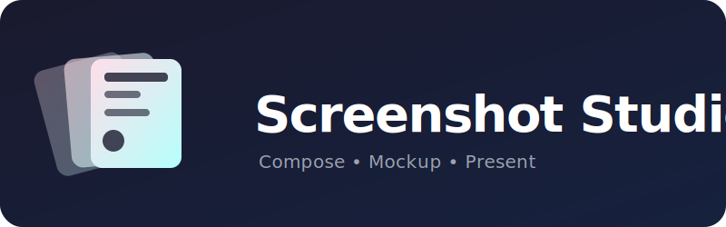
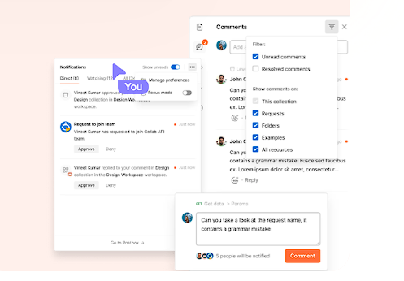
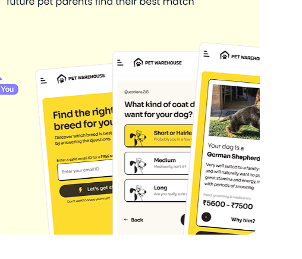
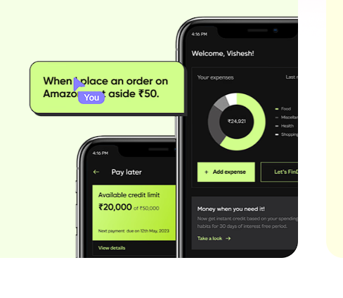

<div align="center">
  
  
  # 📸 Screenshot Studio
  
  **A beautiful, open-source tool for composing, mocking up, and presenting screenshots.**
  
  [](https://opensource.org/licenses/MIT)
  [](https://react.dev)
  [](https://vitejs.dev)
  [](https://tailwindcss.com)

  [Live Demo](https://screenshot-studio-steel.vercel.app/) • [Report Bug & Request Feature](https://github.com/ayushsolanki29/screenshot-studio/issues)
</div>

---

## 🎨 Layout Showcase

You can recreate stunning layouts directly in the studio:

| Layered Annotations | Perspective Fan | Stacked Cards |
| :---: | :---: | :---: |
|  |  |  |
| Create beautiful floating annotations and pointer callouts. | Effortlessly fan out multiple mobile app screens in a 3D perspective. | Overlap and stack multiple browser windows or UI components. |

## 📖 How To Use (User Guide)

Using Screenshot Studio is incredibly simple:

1. **Upload Images**: Drag and drop your screenshots directly onto the infinite canvas, or click to upload.
2. **Choose a Layout**: Use the sidebar to select from 10+ dynamic layouts (Stack, Perspective, Grid, Fan, etc.).
3. **Customize Appearance**: Dial in the spacing, gap, border radius, and add a premium film-grain noise effect.
4. **Select a Background**: Pick from 50+ curated premium backgrounds (Soft Light, Premium Mesh, Dark Minimal).
5. **Pan & Zoom**: Hold `Ctrl` (or `Cmd`) and scroll to zoom in/out, or click and drag the canvas to pan around your composition.
6. **Export**: (Coming Soon) One-click export to high-res PNG or copy straight to clipboard!

## ✨ Features & Roadmap

- [x] **🗺️ Infinite Canvas**: Pan and zoom freely using gesture controls for a professional editing experience.
- [x] **🎨 50+ Premium Backgrounds**: Curated library of minimalist gradients, mesh patterns, and solid colors.
- [x] **🪄 Intelligent Layout Engine**: Includes Hero, Stack, Perspective, Grid, Fan, Layered, and floating layouts.
- [x] **✨ Advanced Effects**: Dial in the perfect look with custom noise, rounded corners, and spacing.
- [ ] **🪄 Auto-Crop (In Progress)**: Automatically detects and removes browser chrome and taskbars.
- [ ] **📝 Text & Shape Annotations (Coming Soon)**: Add beautiful pointer callouts and text.
- [ ] **🚀 High-Res Export (Coming Soon)**: Render directly to high-quality 2x/4x PNGs instantly.

## 🚀 Quick Start (Local Setup)

Ensure you have Node.js 20+ installed.

```bash
# 1. Clone the repository
git clone https://github.com/ayushsolanki29/screenshot-studio.git
cd screenshot-studio

# 2. Install dependencies
npm install

# 3. Start the development server
npm run dev
```

Open `http://localhost:5173` to see the app. You can test the layouts using the sample images provided in the `/public` folder!

## 🛠️ Tech Stack

- **Framework**: React 19 + Vite + TypeScript
- **Styling**: Tailwind CSS v4 + Lucide Icons
- **State**: React Context API
- **Animations**: Framer Motion
- **Canvas/Export**: `html2canvas`, `@use-gesture/react`

## 📄 License

This project is 100% free and open-source under the [MIT License](LICENSE). 

Created by [Ayush Solanki](https://github.com/ayushsolanki29).
